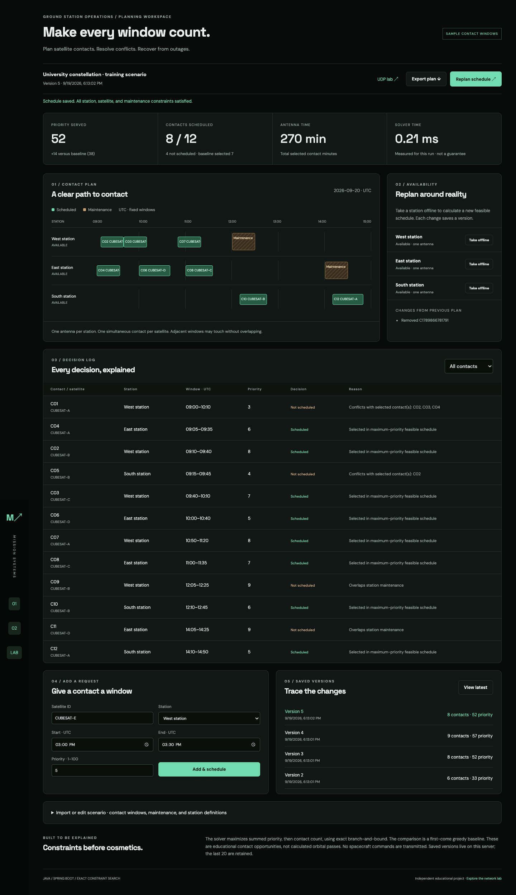

# Mission Scheduler

A Java 21 / Spring Boot application for planning satellite ground-station contact windows. It chooses a maximum-priority feasible schedule, explains conflicts, replans after station outages, and saves the last 20 schedule versions. The primary interface is a black browser dashboard.

**Purpose:** help a student satellite team explore how limited antenna availability and competing contact priorities affect a plan. This is an independent educational implementation, not an operational ground system. Contact windows are supplied inputs, not orbital predictions. The sample satellites and stations are fictional.



## Run

Requires JDK 21 or newer. On macOS, double-click **Mission Scheduler.command**. It uses `target/mission-scheduler-2.0.0.jar` when already built; otherwise it starts through the Maven wrapper. The browser opens after the server responds. For any platform:

```sh
./mvnw spring-boot:run
```

Open http://127.0.0.1:8080. The initial build needs internet access to download Maven and dependencies. No Node installation or database server is required. Stop the server with Ctrl+C in the launcher terminal.

```sh
./mvnw verify                         # tests and executable JAR
java -jar target/mission-scheduler-2.0.0.jar
```

Rebuild with `./mvnw package` after editing source if using the double-click launcher. To use another port: `PORT=8081 ./mission-scheduler`; open that port. The old `Mission Network Lab.command` is retained as a compatibility launcher and now opens the scheduler.

## A two-minute demo

1. Inspect the initial scenario: 12 opportunities across 3 stations. The solver serves 52 priority points using 8 contacts; the first-come baseline serves 38 using 7.
2. Take West station offline. A new version is saved; its schedule serves 33 priority points and explains the rejected West contacts.
3. Restore West. Inspect added/removed contact IDs and the recovered schedule.
4. Add a contact with the form. View its assignment or the reason it was rejected.
5. Open an older version to compare its scenario and plan. Historical versions are read-only; use **View latest** to resume edits or refresh after another tab changes the plan.
6. Export the plan, or use the scenario editor to download/import contact windows and edit maintenance periods. A plan export contains results and provenance; a scenario export contains only the inputs accepted by import.

## Constraint model

- One UTC day; start/end values are minutes since midnight, in `[0, 1440]`, with start strictly before end.
- Windows are fixed intervals. The solver selects or rejects a whole contact; it does not shift or shorten it.
- Each station has one antenna. A satellite may have only one simultaneous selected contact across all stations.
- Unavailable stations and maintenance overlaps disqualify a contact.
- Intervals are half-open: `[start, end)`. Adjacent windows can touch.
- Priorities are positive integer weights from 1 to 100. Objective: maximize their sum, then maximize selected contact count. Remaining ties are broken deterministically using priority/ID traversal order.
- Limits: 24 candidate contacts, 8 stations, 24 maintenance intervals per station. Search is exact branch-and-bound with an optimistic remaining-priority bound. It is exponential in the worst case; this is a small planning tool, not a large-constellation optimizer.
- Baseline: admit eligible contacts in start-time order, breaking ties by ID, when neither station nor satellite conflicts with a prior selection. Both algorithms apply the same availability and maintenance constraints.

There are no orbital calculations, slew/setup times, multi-antenna stations, RF compatibility checks, spacecraft commands, or NASA data integration. Contact IDs denote independent opportunities; multiple non-overlapping contacts for the same satellite may be selected.

## Architecture

Browser → Spring MVC REST API → validated Java records → pure scheduling engine → atomic JSON version store.

- `Scheduling.java`: input model, conflict predicates, deterministic exact search, baseline, and rejection explanations.
- `ScheduleStore.java`: saves versions through an atomic file replacement; only updates memory after a successful write. Revision checks reject stale changes with HTTP 409.
- `ScheduleController.java`: API routes and validation/error responses.
- `scheduler.js`: timeline, request form, import/export, outage controls, and read-only history.

Persistence uses `./data/schedules.json` by default, excluded from Git. The initial sample is in memory until the first save. Configure another path with `--mission.store=/absolute/path/schedules.json`. Keep backups of this file. Startup rejects malformed stored data rather than silently replacing it. Only one server process should use a given store file. The local server binds to 127.0.0.1, shares one workspace across browser tabs, and has no login system.

Storage is deliberately file-backed for an easy local demo. PostgreSQL, multiuser sessions, and authentication are not implemented. Mutations use REST and return the updated state; this app has no WebSocket endpoint. Another browser tab can refresh with **View latest**.

| Method | Endpoint | Behavior |
|---|---|---|
| GET | `/api/schedules` | Latest-first saved versions, including scenarios and decisions |
| GET | `/api/schedules/example` | Sample scenario for editing/import |
| POST | `/api/schedules` | Validate, solve, and persist `{expectedRevision, scenario}` |

## Verification

`./mvnw verify` runs solver, persistence, REST integration, and UDP lab tests, plus the five original mission-planner regressions. The solver is compared against an independently implemented exhaustive oracle on 60 seeded small scenarios. Tests cover satellite/station conflicts, touching windows, outages, maintenance, invalid imports, empty input, durable recovery, bounded history, failed writes, and stale revisions.

The test run writes `target/benchmark.md`; [the recorded local benchmark](docs/BENCHMARK.md) states the machine/runtime context and measured results. These numbers describe the included small sample only. GitHub Actions runs Java 21 verification on Ubuntu.

Desktop/mobile browser checks covered outage/restore, adding a request, history, persistence across page reloads, filters, export, invalid import, and sample import. No browser JavaScript errors or page-width overflow were observed. Horizontal timeline/table scrolling is intentional on small screens.

## Learning and résumé discussion

Read [the scheduling walkthrough](docs/SCHEDULER-GUIDE.md) and [role research](docs/ROLE-RESEARCH.md). The original Java scheduling engine remains under `planning/`; its task-dependency model is separate from the new resource-allocation solver.

The [UDP learning lab](http://127.0.0.1:8080/network.html) remains available at `/network.html`, with [its implementation notes](docs/NETWORK-LAB.md) and [Java/networking guide](docs/LEARNING.md). It transmits real loopback packets with modeled delay, loss, and two-path failover; it does not feed satellite contact availability.
